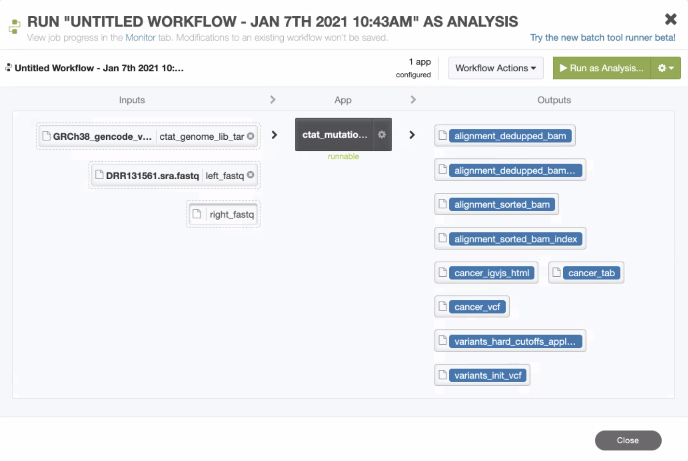
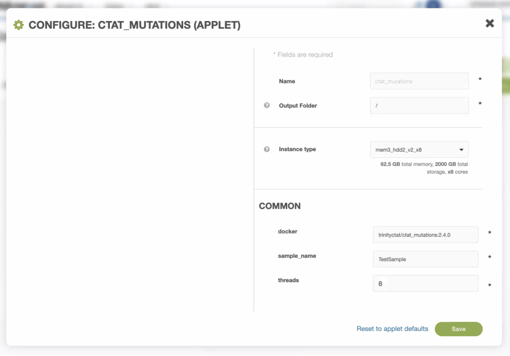

# expressed-variant-impact

# Contributors
Brian Haas (bhaas@broadinstitute.org)

Olaitan I. Awe (laitanawe@gmail.com)

Meghana Pagadala (mpagadal@ucsd.edu)

Kym Pagel (kpagel1@jhu.edu)


# Why Trinity CTAT?

The CTAT-Mutation pipeline (https://github.com/NCIP/ctat-mutations/wiki) makes it easy to discover variants from RNA-seq data, and requires only the RNA-seq reads as input. The pipeline also annotates variants, including the RADAR and RediPortal databases for identifying likely RNA-editing events, dbSNP and gnomAD for annotating common variants, COSMIC to highlight known cancer mutations, and OpenCRAVAT to annotate and prioritize variants according to likely biological impact and relevance to cancer.

The CTAT-Mutations Pipeline integrates GATK Best Practices along with downstream steps to annotate and filter variants, and to additionally prioritize variants that may be relevant to cancer biology. 


# How does this pipeline work?

 

[Workflow](img/ctat_workflow.png)

# How to use the pipeline

## Input

A RNA-seq fastq file.

We encoded the pipeline using Workflow Description Language (WDL) that was tested on an outside platform for fidelity, and it and ran without significant problems. Each fastq took about two hours, including data loading. The WDL implementation was then moved to DNA Nexus, and an app was created with: 

```java -jar dxWDL-v1.50.jar compile ctat_mutations_2pt5.wdl -project project-FzpxV2j06F1JYgg6F553Z9yv```. 


All fastq samples were run in batch mode on DNANexus via:

```
dx generate_batch_inputs -istage-common.left_fastq="(.*).fastq$"

dx run /ctat_mutations_wf \
   -istage-common.ctat_genome_lib_tar=/genome_resources/GRCh38_gencode_v22_CTAT_lib_Apr032020.wMutLib.dx.tar \
   --batch-tsv dx_batch.0000.tsv \
   --destination=/ctat_pipe_outputs \
   --instance-type=mem3_hdd2_v2_x8 \
   --batch-folders -istage-common.sample_name=dx \
   -istage-common.docker="trinityctat/ctat_mutations:2.5.0" \
   -istage-common.threads=8

```


In DNA Nexus, the workflow ontains the following components: 



For the example run, the following configuration settings were used: 



## Output

The output from the CTAT-Mutations pipeline includes variant vcf files, summary tab-delimited reports, and interactive visualizations. The outputs include the following:

- variants.HC_init.wAnnot.vcf.gz contains HaplotypeCaller variant calls fully annotated. 
- A cancer.vcf and corresponding simpler summary cancer.tab file, contain a set of prioritized cancer-relevant variants detected in the sample. 
- Additional outputs that are generated by the different stages of the CTAT-Mutations pipeline, as others are likely to be of interest as well for exploring RNA-editing or common variants. 
- There is also an html page output (based on igv-reports), which allows for dynamic navigation of the identified cancer variants and the read evidence supporting their identification. 


## Annotations included by default

- Known or predicted RNA-editing site
- If the variant has entries in OMIM/OMIA or Clinical PubMed
- dbSNP ID and Variant Allele Origin (VAO, 0-unspecified 1-Germline 2-Somatic 3-Both)
- gnomAD allele frequency
- VAF
- Repeat family from UCSC Genome Browser Repeatmasker Annotations
- ADjacency to homopolymer sequence or splice sites
- Entropy around the variant
- COSMIC annotations, including somatic status
- HUGO Gene impacted and canonical transcript identifier
- Variant impact (sequence ontology)
- HGVS notation
- Number of samples that contain this variant
- CHASMplus driver status prediction
- ClinVar annotations
- Link to protein visualization
- Variant pathogenicity prediction by VEST and FATHMM

# Accessibility:

CTAT variant calling pipeline is available through OpenCRAVAT, aa open source, scalable decision support system for analysis of variant and gene information. Users can access OpenCRAVAT with a dynamic GUI, download tools, create customized pipelines, and explore results. DNAnexus platform allows for app and pipeline import in addition to a library of available apps for variant and transcriptome analysis. CTAT pipeline used for this project can be found with DNAnexus ID: project-FzpxV2j06F1JYgg6F553Z9yv:applet-FzqfjGQ06F12qGyj3jjZFKV1


# Testing

## Dataset

CTAT pipeline was applied to a dataset (Suzuki et al. 2019, ENA accession: PRJDB6952). Suzuki et al. treated 23 lung cancer cell lines with 95 compounds including approved receptor tyrosine kinase inhibitors and epigenetic targeting drugs. High-throughput RNAseq was conducted with four different concentrations and three time points (24,48,72h). 

3 cell lines and 4 treatments were included for testing (124 total).

| Cell Line  | Drug | Number of Samples |
| ------------- | ------------- |------------- |
| **A549** | (+)-JQ1 (Inhibitor_BET (BRD4))  | 12  | 
|  | DMSO (Control)  | 9  | 
|  | Etoposide (Inhibitor_Topo II)  | 11  | 
|  | Temsirolimus (Inhibitor_mTOR)  | 11  | 
| **H1299**  | (+)-JQ1 (Inhibitor_BET (BRD4))  | 11  | 
|  | DMSO (Control)  | 9  | 
|  | Etoposide (Inhibitor_Topo II)  | 12  | 
|  | Temsirolimus (Inhibitor_mTOR)  | 11  | 
| **II-18** | (+)-JQ1 (Inhibitor_BET (BRD4))  | 8  | 
|  | DMSO (Control)  | 8  | 
|  | Etoposide (Inhibitor_Topo II)  | 11  | 
|  | Temsirolimus (Inhibitor_mTOR)  | 11  | 

See **SraRunTable_filtered.txt** for individual level metadata.

# References

- Data https://www.nature.com/articles/s41598-019-55692-9 
- CTAT pipeline https://github.com/NCIP/ctat-mutations/wiki 
- OpenCRAVAT https://www.cancergeneticsjournal.org/article/S2210-7762(20)30193-9/pdf 
